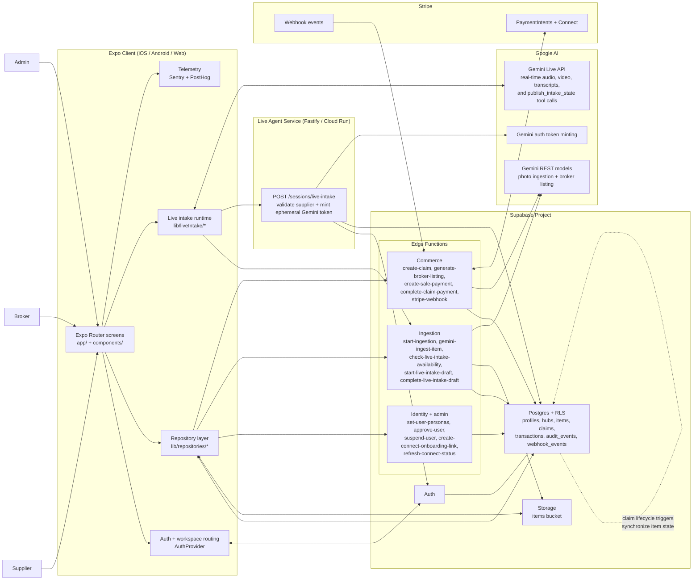

# System Architecture

This diagram reflects the current runtime shape of TATO in this repository: an Expo client, a Supabase-backed domain layer, a separate live-agent bootstrap service for Gemini Live, and external Stripe and Gemini integrations.

## High-Level Diagram

## Runtime Boundaries

- The Expo client uses the Supabase anon client for sign-in, session restore, direct reads, and storage uploads that are protected by RLS.
- Sensitive mutations live behind Edge Functions. That includes payment intent creation, AI enrichment, admin actions, and idempotent workflow writes.
- Live intake is split across two backends:
  - the live-agent service validates the supplier and mints a short-lived Gemini Live credential
  - the device then connects directly to Gemini Live for the real-time session
- Stripe is authoritative for payment events, while Supabase stores the platform ledger, claim status, payout split rows, refunds, and audit trail.

## Main Product Flows

- Supplier photo ingestion:
  - client invokes `start-ingestion`
  - client uploads the image into Supabase Storage
  - client invokes `gemini-ingest-item`
  - Gemini analysis is written back onto `items` and the item moves to `ready_for_claim`
- Supplier live intake:
  - client checks availability in Supabase
  - client requests a bootstrap from the live-agent service
  - client streams audio and video directly to Gemini Live
  - Gemini returns spoken guidance plus structured `publish_intake_state` tool output
  - client creates a draft item, uploads a snapshot, and finalizes the item through `complete-live-intake-draft`
- Broker claim and listing:
  - broker creates a claim through `create-claim`
  - the function creates the claim row, Stripe deposit intent, and transaction row together
  - broker can then call `generate-broker-listing` to produce AI listing copy and platform variants
- Sale payment and settlement:
  - supplier creates the final sale payment through `create-sale-payment`
  - Stripe sends webhook events back to `stripe-webhook`
  - the webhook marks the base transaction, writes supplier/broker/platform split rows, refunds the claim deposit when appropriate, and completes the claim

## Related Docs

- Live intake bootstrap contract: [live-agent-service.md](./live-agent-service.md)
- Operational checks: [operations.md](./operations.md)
- Incident handling: [incident-runbook.md](./incident-runbook.md)
